Read file: frontend/src/routes/_layout.tsx
Read file: frontend/src/client/index.ts
Read file: frontend/src/hooks/useAuth.ts
Read file: backend/app/models.py
## 📊 `http://localhost:5173/admin` 页面架构分析

基于代码分析，我为您详细列出前后台开发规范和各层接口：


## 🏗️ **整体架构概览**

```
┌─────────────────────────────────────────────────────────────┐
│                     浏览器端 (React)                        │
├─────────────────────────────────────────────────────────────┤
│  Routes → Components → Hooks → API Client → HTTP 请求      │
└─────────────────────────────────────────────────────────────┘
                                ↕ HTTP/REST
┌─────────────────────────────────────────────────────────────┐
│                    服务器端 (FastAPI)                       │
├─────────────────────────────────────────────────────────────┤
│  API Routes → Dependencies → CRUD → Models → Database      │
└─────────────────────────────────────────────────────────────┘
```

---

## 🎨 **前端架构分析**

### **1. 路由层级结构**
```typescript
// 路由树结构
__root.tsx                          // 根路由
├── _layout.tsx                     // 布局路由（需要认证）
│   ├── admin.tsx                  // /admin - 用户管理页面 ⭐
│   ├── index.tsx                  // / - 首页
│   ├── items.tsx                  // /items - 项目管理
│   └── settings.tsx               // /settings - 用户设置
├── login.tsx                      // /login - 登录页面
├── signup.tsx                     // /signup - 注册页面
├── recover-password.tsx           // /recover-password
└── reset-password.tsx             // /reset-password
```

### **2. Admin页面组件层次**
```typescript
// /admin 页面组件结构
Admin                              // 主页面容器
├── AddUser                       // 新增用户组件
├── UsersTable                    // 用户表格组件
│   ├── SearchForm               // 搜索表单
│   ├── Table                    // 数据表格
│   └── Pagination              // 分页组件
└── UserActionsMenu              // 用户操作菜单
    ├── EditUser                 // 编辑用户
    └── DeleteUser               // 删除用户
```

### **3. 前端开发规范**

#### **路由规范**
```typescript
// 使用 TanStack Router
export const Route = createFileRoute("/_layout/admin")({
  component: Admin,
  validateSearch: usersSearchSchema,  // 搜索参数验证
})

// 搜索参数Schema定义
const usersSearchSchema = z.object({
  page: z.number().catch(1),
  full_name: z.string().optional(),
  email: z.string().optional(),
  role: z.string().optional(),
  status: z.string().optional(),
})
```

#### **状态管理规范**
```typescript
// 使用 TanStack Query 进行状态管理
const { data, isLoading, isPlaceholderData } = useQuery({
  ...getUsersQueryOptions({ page, full_name, email, role, status }),
  placeholderData: (prevData) => prevData,
})

// 查询配置函数
function getUsersQueryOptions({ page, full_name, email, role, status }) {
  return {
    queryFn: () => UsersService.readUsers(params),
    queryKey: ["users", { page, full_name, email, role, status }],
  }
}
```

#### **组件设计规范**
```typescript
// 功能组件模式
const SearchForm = ({ onSearch, onReset }: SearchFormProps) => {
  // 使用 useState 管理表单状态
  const [fullName, setFullName] = useState("")
  
  // 使用 useNavigate 进行路由导航
  const navigate = useNavigate({ from: Route.fullPath })
  
  // 事件处理函数
  const handleSearch = () => {
    const filters: any = {}
    if (fullName.trim()) filters.full_name = fullName.trim()
    onSearch(filters)
  }
}
```

#### **样式规范**
```typescript
// 使用 Chakra UI 组件库
import { Badge, Container, Flex, Heading, Table, Box, Input, Button, Stack, Grid, GridItem } from "@chakra-ui/react"

// 响应式布局
<Grid 
  templateColumns={{ 
    base: "1fr", 
    md: "repeat(2, 1fr)", 
    lg: "repeat(4, 1fr)" 
  }} 
  gap={4} 
  mb={4}
>
```

---

## ⚙️ **后端架构分析**

### **1. API路由结构**
```python
# api/main.py - 路由汇总
api_router = APIRouter()
api_router.include_router(login.router)     # 认证相关
api_router.include_router(users.router)     # 用户管理 ⭐
api_router.include_router(utils.router)     # 工具接口
api_router.include_router(items.router)     # 项目管理
```

### **2. Users API 接口详细**
```python
# backend/app/api/routes/users.py
router = APIRouter(prefix="/users", tags=["users"])

# 核心接口列表：
GET    /users/                    # 获取用户列表（支持筛选）⭐
POST   /users/                    # 创建用户
GET    /users/me                  # 获取当前用户信息
PATCH  /users/me                  # 更新当前用户信息
PATCH  /users/me/password         # 修改当前用户密码
DELETE /users/me                  # 删除当前用户
POST   /users/signup              # 用户注册
GET    /users/{user_id}           # 获取指定用户信息
PATCH  /users/{user_id}           # 更新指定用户信息
DELETE /users/{user_id}           # 删除指定用户
```

### **3. 后端开发规范**

#### **路由定义规范**
```python
@router.get(
    "/",
    dependencies=[Depends(get_current_active_superuser)],  # 权限控制
    response_model=UsersPublic,                            # 响应模型
)
def read_users(
    session: SessionDep,                                   # 数据库会话依赖
    skip: int = 0,                                        # 分页参数
    limit: int = 100,
    full_name: str | None = Query(None, description="搜索全名（模糊匹配）"),  # 查询参数
    email: str | None = Query(None, description="搜索邮箱（模糊匹配）"), 
    role: str | None = Query(None, description="用户角色，可选值：superuser, user"),
    status: str | None = Query(None, description="用户状态，可选值：active, inactive")
) -> Any:
```

#### **数据库查询规范**
```python
# 构建查询条件
conditions = []
if full_name:
    conditions.append(col(User.full_name).icontains(full_name))
if email:
    conditions.append(col(User.email).icontains(email))

# 构建查询语句
base_query = select(User)
count_query = select(func.count()).select_from(User)

# 应用过滤条件
if conditions:
    for condition in conditions:
        base_query = base_query.where(condition)
        count_query = count_query.where(condition)
```

#### **依赖注入规范**
```python
# api/deps.py
CurrentUser = Annotated[User, Depends(get_current_user)]
SessionDep = Annotated[Session, Depends(get_session)]

def get_current_active_superuser(current_user: CurrentUser) -> User:
    if not current_user.is_superuser:
        raise HTTPException(
            status_code=403, detail="The user doesn't have enough privileges"
        )
    return current_user
```

---

## 📋 **数据模型规范**

### **1. SQLModel 数据模型层次**
```python
# 基础模型
class UserBase(SQLModel):
    email: EmailStr = Field(unique=True, index=True, max_length=255)
    is_active: bool = True
    is_superuser: bool = False
    full_name: str | None = Field(default=None, max_length=255)

# 数据库模型
class User(UserBase, table=True):
    id: uuid.UUID = Field(default_factory=uuid.uuid4, primary_key=True)
    hashed_password: str
    items: list["Item"] = Relationship(back_populates="owner", cascade_delete=True)

# API输入模型
class UserCreate(UserBase):
    password: str = Field(min_length=8, max_length=40)

class UserUpdate(UserBase):
    email: EmailStr | None = Field(default=None, max_length=255)
    password: str | None = Field(default=None, min_length=8, max_length=40)

# API输出模型
class UserPublic(UserBase):
    id: uuid.UUID

class UsersPublic(SQLModel):
    data: list[UserPublic]
    count: int
```

---

## 🔄 **各层接口交互流程**

### **1. 用户列表查询流程**

```mermaid
sequenceDiagram
    participant F as Frontend
    participant API as FastAPI
    participant DB as Database
    
    F->>API: GET /api/v1/users/?full_name=xxx&role=user
    API->>API: 验证用户权限 (superuser)
    API->>API: 解析查询参数
    API->>DB: SELECT * FROM users WHERE conditions
    DB->>API: 返回用户数据
    API->>F: UsersPublic{data: [], count: 10}
    F->>F: 更新组件状态 & 重新渲染
```


### **2. 创建用户流程**

```mermaid
sequenceDiagram
    participant F as Frontend
    participant API as FastAPI
    participant DB as Database
    
    F->>API: POST /api/v1/users/ {UserCreate}
    API->>API: 验证权限 & 数据验证
    API->>DB: 检查邮箱是否已存在
    API->>DB: INSERT INTO users
    API->>API: 发送欢迎邮件 (可选)
    API->>F: UserPublic
    F->>F: invalidateQueries(["users"])
```


---

## 🛡️ **安全与认证规范**

### **1. 前端认证流程**
```typescript
// hooks/useAuth.ts
const useAuth = () => {
  const { data: user } = useQuery<UserPublic | null, Error>({
    queryKey: ["currentUser"],
    queryFn: UsersService.readUserMe,
    enabled: isLoggedIn(),  // 检查token是否存在
  })

  const login = async (data: AccessToken) => {
    const response = await LoginService.loginAccessToken({ formData: data })
    localStorage.setItem("access_token", response.access_token)
  }
}
```

### **2. 后端权限控制**
```python
# 路由级别权限控制
@router.get("/", dependencies=[Depends(get_current_active_superuser)])

# 依赖注入权限验证
def get_current_active_superuser(current_user: CurrentUser) -> User:
    if not current_user.is_superuser:
        raise HTTPException(status_code=403, detail="权限不足")
    return current_user
```

---

## 📦 **技术栈总结**

### **前端技术栈**
- **路由**: TanStack Router
- **状态管理**: TanStack Query + React Hooks
- **UI框架**: Chakra UI + React Icons
- **表单处理**: React Hook Form
- **类型检查**: TypeScript + Zod
- **HTTP客户端**: 自动生成的OpenAPI客户端

### **后端技术栈**
- **Web框架**: FastAPI
- **ORM**: SQLModel (基于SQLAlchemy 2.0)
- **数据库**: PostgreSQL
- **认证**: JWT + OAuth2
- **API文档**: 自动生成OpenAPI Schema
- **数据验证**: Pydantic

### **开发工具**
- **包管理**: uv (后端) + npm (前端)
- **API生成**: OpenAPI TypeScript Generator
- **代码规范**: Ruff (后端) + Biome (前端)
